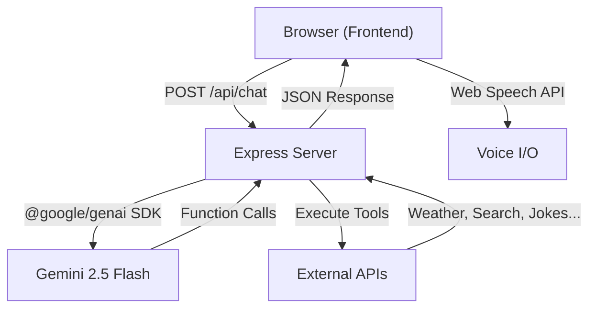

# J.A.R.V.I.S. — Agentic AI Assistant — Walkthrough

## What Was Built

A fully functional, voice-enabled AI assistant web app inspired by Iron Man's JARVIS, featuring a futuristic HUD interface and agentic capabilities powered by Google's Gemini API.

---

## Architecture

| Layer | Technology |
|-------|-----------|
| Frontend | Vanilla HTML/CSS/JS |
| Backend | Node.js + Express |
| AI Brain | Gemini 2.5 Flash (free tier) |
| Voice | Web Speech API (SpeechRecognition + SpeechSynthesis) |
| Styling | CSS Custom Properties, Glassmorphism, CSS Animations |

---

## File Structure

| File | Purpose |
|------|---------|
| [server.js](file:///c:/Users/astik/OneDrive/Desktop/jarvis-maybe/server.js) | Express backend — Gemini API proxy, 8 tool executors, system prompt |
| [package.json](file:///c:/Users/astik/OneDrive/Desktop/jarvis-maybe/package.json) | Dependencies: express, @google/genai, dotenv |
| [index.html](file:///c:/Users/astik/OneDrive/Desktop/jarvis-maybe/public/index.html) | HUD layout — reactor, panels, chat, input, modal |
| [index.css](file:///c:/Users/astik/OneDrive/Desktop/jarvis-maybe/public/css/index.css) | Design system — tokens, resets, animations |
| [reactor.css](file:///c:/Users/astik/OneDrive/Desktop/jarvis-maybe/public/css/reactor.css) | Arc reactor — 4 state variants, waveform |
| [hud.css](file:///c:/Users/astik/OneDrive/Desktop/jarvis-maybe/public/css/hud.css) | Glassmorphic panels, status bar, modal, responsive |
| [chat.css](file:///c:/Users/astik/OneDrive/Desktop/jarvis-maybe/public/css/chat.css) | Message bubbles, tool badges, typing indicator |
| [app.js](file:///c:/Users/astik/OneDrive/Desktop/jarvis-maybe/public/js/app.js) | Main orchestrator — wires all modules, boot sequence |
| [voice.js](file:///c:/Users/astik/OneDrive/Desktop/jarvis-maybe/public/js/voice.js) | Speech recognition + TTS with British voice selection |
| [chat.js](file:///c:/Users/astik/OneDrive/Desktop/jarvis-maybe/public/js/chat.js) | Chat UI — message rendering, history, auto-scroll |
| [agent.js](file:///c:/Users/astik/OneDrive/Desktop/jarvis-maybe/public/js/agent.js) | Backend communication, tool callbacks, error handling |
| [reactor.js](file:///c:/Users/astik/OneDrive/Desktop/jarvis-maybe/public/js/reactor.js) | Reactor state manager (idle/listening/thinking/speaking) |
| [particles.js](file:///c:/Users/astik/OneDrive/Desktop/jarvis-maybe/public/js/particles.js) | Canvas particle system with constellation connections |

---

## Features

### 🎨 Futuristic HUD Interface
- **Arc Reactor** — Animated concentric rings with 4 state colors (cyan/green/gold/cyan-bright)
- **Glassmorphic Panels** — Frosted glass effect with scan-line hover animations
- **Particle Background** — Canvas-based floating particles with connection lines
- **Live Clock** — Real-time clock and date in the status bar
- **Activity Log** — Tracks all user commands and tool executions

### 🎙 Voice Interaction
- Click the mic button or say **"Hey JARVIS"** to activate
- Real-time speech-to-text via Web Speech API
- JARVIS speaks responses aloud using text-to-speech
- Auto-selects the best British English voice available

### 🧠 8 Agentic Tools
The AI autonomously decides when to use tools based on your request:

| Tool | What It Does | Example Prompt |
|------|-------------|----------------|
| ⏰ Time | Current time in any timezone | "What time is it in Tokyo?" |
| 🌤 Weather | Real weather data (Open-Meteo) | "Weather in London?" |
| 🔍 Search | Web search (DuckDuckGo) | "Search for quantum computing" |
| 🔢 Calculator | Math expressions | "What's the square root of 144?" |
| ⏰ Reminder | Timed browser notifications | "Remind me in 5 minutes to stretch" |
| 📰 News | Headlines by topic | "What's the latest in tech?" |
| 😄 Jokes | Random jokes | "Tell me a programming joke" |
| 📊 Diagnostics | Server system status | "Run a system diagnostic" |
| Open <website> | Opens mentioned website | "Open Youtube (or specific website URL)" |

### 🔄 State-Reactive UI
The arc reactor changes color and animation speed based on JARVIS's state:
- **Cyan** (idle) — Standard gentle pulse
- **Green** (listening) — Microphone active, capturing speech
- **Gold** (thinking) — Fast spinning rings, processing with Gemini
- **Bright Cyan** (speaking) — Waveform active, TTS output

---

## How to Use

1. **Get a free Gemini API key** from [Google AI Studio](https://aistudio.google.com/apikey)
2. Start the server: `npm start`
3. Open http://localhost:3000
4. Enter your API key in the initialization modal
5. Start talking to JARVIS via text or voice!

---

## Validation

- ✅ Server starts successfully on port 3000
- ✅ Frontend renders with all visual elements (particles, reactor, panels, modal)
- ✅ No JavaScript console errors
- ✅ API key modal displays correctly for first-run experience
- ✅ Activity log tracks boot sequence
- ✅ Voice system initializes and selects appropriate voice
